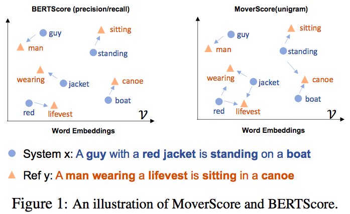
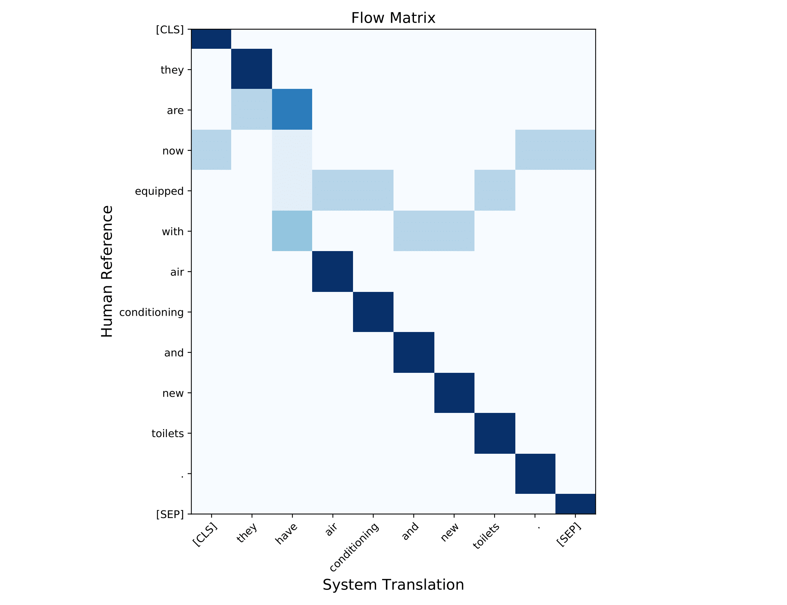

MoverScore ([Zhao et.al, 2019](https://arxiv.org/pdf/1909.02622.pdf)) is a monolingual measure of evaluating the similarity between a sentence pair written in the same language. It achieves much higher correlation with human judgments than BLEU on machine translation, summarization and image captioning. By default, this repo uses English BERT to measure the similarity of a English sentence pair. For other languages, a multilingual BERT in moverscore_v2.py has to be specified.

Note that moverscore.py is a complete version for reproducibility but slow to run, while moverscore_v2.py is a faster version that disables powermean but a bit worse in performance.

# Overview

The following Figure describes the way that MoverScore uses BERT and Earth Mover Distance to measure the similarity between two sentences.  

<p align="center">

</p>

<!--
# QUICK START

Install the Python module (Python 3 only and GPU required)

    pip3 install moverscore
!-->

# Evaluating Machine Translation and Summarization with MoverScore 

```python
# Use the original version with BERTMNLI to reproduce the results.
#from moverscore import get_idf_dict, word_mover_score
# Recommend to use this version (DistilBERT) for evaluation, if the speed is your concern.
from moverscore_v2 import get_idf_dict, word_mover_score 
from collections import defaultdict

idf_dict_hyp = get_idf_dict(translations) # idf_dict_hyp = defaultdict(lambda: 1.)
idf_dict_ref = get_idf_dict(references) # idf_dict_ref = defaultdict(lambda: 1.)

scores = word_mover_score(references, translations, idf_dict_ref, idf_dict_hyp, \
                          stop_words=[], n_gram=1, remove_subwords=True)
```
| Parameters       | Description                        |
|----------------|----------------------------|
| references       | a list of reference texts      |
| translations     | a list of system translation texts            |
| idf_dict_ref     | idf dictionary extracted from the reference corpus | 
| idf_dict_hyp     | idf dictionary extracted from the system hypothesis corpus | 
| stopwords        | a set of functional words (e.g., being used in text summarization because of lengthy sequences)  | 
| n_gram           | unigram-based MoverScore (n-gram=1), bigram-based MoverScore (n-gram=2) | 
| remove_subwords  | when subwords, e.g., verb tense ('ING/ED') need to be removed | 

### Reporting MoverScore at sentence and corpus levels.

Single- and multi-references evaluations are supported. The input format is exactly identical as in SacreBLEU. See the usage in example/example.py.

```python
refs = [['The dog bit the man.', 'It was not unexpected.', 'The man bit him first.'],
        ['The dog had bit the man.', 'No one was surprised.', 'The man had bitten the dog.']]
sys = ['The dog bit the man.', "It wasn't surprising.", 'The man had just bitten him.']

moverscore = corpus_score(sys, refs)
```

```python
refs = ['The dog bit the man.', 'The dog had bit the man.']
sys = 'The dog bit the man.'

moverscore = sentence_score(sys, refs)
```

### Use another model instead of DistilBert

```python
import os 
os.environ['MOVERSCORE_MODEL'] = "albert-base-v2"

from moverscore_v2 import get_idf_dict
idf_dict_hyp = get_idf_dict(translations)
```

### The Results in Machine Translation

System                  | cs-en | de-en | ru-en | tr-en | zh-en
----------------------- | :------: | :----------: | :------: | :------: | :------:
SentBLEU                | 0.435 | 0.432 | 0.484 |  0.538 | 0.512 
RUSE(supervised metric) | 0.624 | 0.644 | 0.673 | 0.716 | 0.691 
BERTScore               | 0.670 | 0.686 | 0.729 | 0.714 | 0.704 
WMD-1+BERTMNLI+PMeans   | 0.670    | 0.708     | **0.738** | 0.762| **0.744**
WMD-2+BERTMNLI+PMeans   | **0.679** | **0.710**     | 0.736 | **0.763**| 0.740

This repo knows the dataset in WMT17 and handles downloading & preprocessing silently. 

Obtain the results in WMT17 with one line code:

```bash
python examples/run_MT.py

```

### The Results in Summarization (TAC-2009)

System                  | Resp(Pearson) | Resp(Spearman) | Pyr(Pearson) | Pyr(Spearman)
----------------------- | :------: | :----------: | :------: | :------: 
ROUGE-1                | 0.704 |  0.565 |  0.808 | 0.692
ROUGE-2                | 0.727 |  0.583 |  0.803 | 0.694
WMD-1+BERTMNLI+PMeans  | **0.754** |  **0.594** |  **0.831** | **0.701**

```bash
python examples/run_summarization.py
```
# Visualization
```python
from moverscore_v2 import plot_example

reference = 'they are now equipped with air conditioning and new toilets.'
translation = 'they have air conditioning and new toilets.'
plot_example(True, reference, translation)
```
<p align="center">

</p>

# Reference
If you find our source code useful, please consider citing our work.
```
@inproceedings{zhao2019moverscore,
  title = {MoverScore: Text Generation Evaluating with Contextualized Embeddings and Earth Mover Distance},
  month = {August},
  year = {2019},
  author = {Wei Zhao, Maxime Peyrard, Fei Liu, Yang Gao, Christian M. Meyer, Steffen Eger},
  address = {Hong Kong, China},
  publisher = {Association for Computational Linguistics},
  booktitle = {Proceedings of the 2019 Conference on Empirical Methods in Natural Language Processing},
}
```
